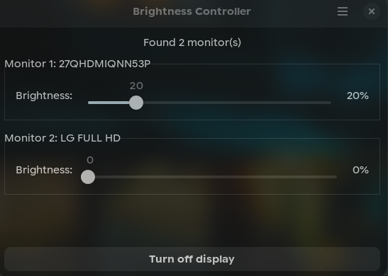
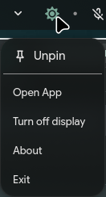

# DDCutil Brightness Controller

A sleek, GTK3-based system tray application and GUI controller for managing external monitor brightness using `ddcutil` on **Linux**.




## Features
- **Multi-Monitor Support:** Automatically detects and manages multiple DDC/CI compatible external displays.
- **System Tray Integration:** Clean tray applet that seamlessly integrates with your desktop environment.
- **Dynamic Theming:** Automatically adapts to light and dark GTK themes.
- **Headless Mode:** Run quietly in the background without launching the main window on startup.
- **Display Power Management:** Instantly turn off your displays (Currently **Hyprland v0.55+ specific** using `hl.dsp.dpms`).

## Prerequisites

This application interacts with external monitors via DDC/CI. You **must** have `ddcutil` installed and configured on your system.

```bash
# Arch Linux
sudo pacman -S ddcutil

# Ubuntu/Debian
sudo apt install ddcutil

# Fedora
sudo dnf copr enable rockowitz/ddcutil
sudo dnf install ddcutil

```
**Note:** `dnf-plugins-core` must be installed (Fedora only).

**Important:** To allow the application to adjust brightness without root privileges, ensure your user is added to the `i2c` group and the `i2c-dev` module is loaded:
```bash
sudo usermod -aG i2c $USER
```
*(You may need to reboot or re-login for the group change to take effect).*

## Usage

You can launch the pre-compiled binary directly. There is no need to install Python or any dependencies if you are using the packed executable.

```bash
./ddcutil-brightness-controller [OPTIONS]
```

### Arguments

| Argument | Description |
| :--- | :--- |
| `-H`, `--help` | Show the help message and exit |
| `-v`, `--verbose` | Enable verbose console output for debugging |
| `-V`, `--version` | Show the application version info |
| `--headless` | Run in the background showing only the system tray icon |

## Build the Binary with PyInstaller

First, make sure PyInstaller is installed in your environment:
```bash
pip install pyinstaller
```

Navigate to your project root folder (where `src` and `res` live) and run the following command. Note the `--add-data` flag, which tells PyInstaller to include your resources and where to put them inside the bundle:
```bash
pyinstaller --onefile --add-data "res:res" src/main.py
```

**Breaking down the flags:**

- `--onefile`: Packages everything into a single executable binary.
- `--add-data "res:res"`: Tells it to take the local `res` directory and copy it into a folder named `res` inside the binary's root environment. On Linux, the syntax is `"source:destination"`.
- `src/main.py`: The entry point of your application.

### Locating the Output

Once the build finishes, you will see a few new directories in your project root:

- `build/`: Contains temporary log and working files used during bundling.
- `main.spec`: A configuration file created by PyInstaller.
- `dist/`: This is where your single binary lives.

Inside `dist/`, you will find an executable named `main`. You can rename it to whatever you want (e.g., `ddcutil-brightness-controller`), move it anywhere on your Linux system, and run it directly with your arguments:
```bash
./dist/main
```

## Future Plans

- **Advanced `ddcutil` Integration:** Expose more display features like contrast, input source switching, and color presets.
- **`brightnessctl` Support:** Add seamless support for internal laptop displays alongside external monitors.
- **Localization (i18n):** Add support for more languages to make the app accessible globally.

## Legal

This application comes with absolutely no warranty. See the GNU General Public License, version 3 or later for details.
